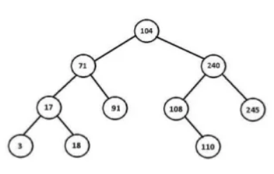

# Haskell Tree Demo

## How to test

### Verify ghci

    ghci --version

### Run

    ghci

### Load

    :load ./src/Tree

### Insert Node

    my_tree_init = Empty
    my_tree_104 = insertNode 104 my_tree_init
    my_tree_104
    my_tree_71 = insertNode 71 my_tree_104
    my_tree_71
    my_tree_240 = insertNode 240 my_tree_71
    my_tree_240
    my_tree_91 = insertNode 91 my_tree_240
    my_tree_91
    my_tree_17 = insertNode 17 my_tree_91
    my_tree_17
    my_tree_3 = insertNode 3 my_tree_17
    my_tree_3
    my_tree_18 = insertNode 18 my_tree_3
    my_tree_18
    my_tree_108 = insertNode 108 my_tree_18
    my_tree_108
    my_tree_245 = insertNode 245 my_tree_108
    my_tree_245
    my_tree_110 = insertNode 110 my_tree_245
    my_tree_110

    myFinalTree = my_tree_110

#### Result Tree

### Print Tree

    test_print_tree

### Print Count Nodes

    test_print_count_nodes

### Print Count Leaves
    
    test_print_count_leaves

### Print tree height
    
    test_print_tree_height

### Print preorder
    
    test_print_preorder

### Print inorder
    
    test_print_inorder

### Print postorder
    
    test_print_postorder